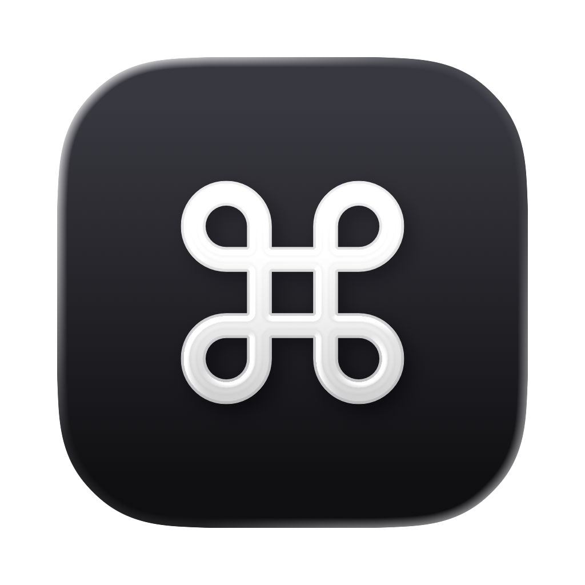
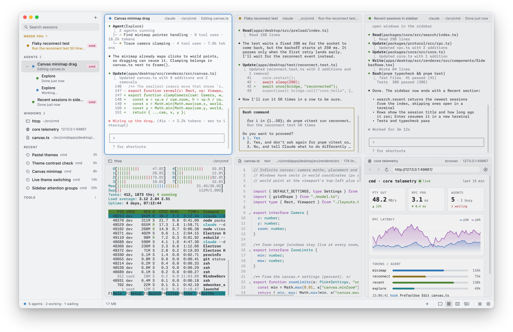
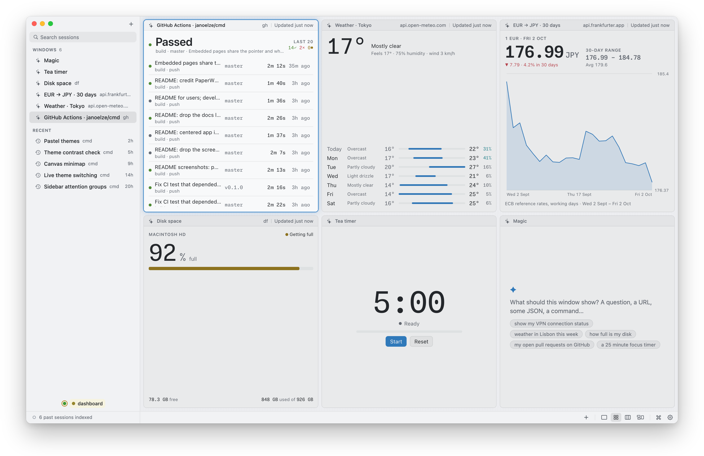

<p align="center">
  
</p>

<h1 align="center">cmd</h1>

<p align="center">
  A macOS app for running terminals and coding agents side by side.
</p>

<p align="center">
  <a href="https://github.com/janoelze/cmd/releases/latest">Download</a> ·
  <a href="https://endtime-instruments.org/cmd/">Website</a> ·
  <a href="#features">Features</a> ·
  <a href="#magic-widgets">Magic widgets</a> ·
  <a href="#keyboard-shortcuts">Shortcuts</a> ·
  <a href="#cli">CLI</a> ·
  <a href="DEVELOPMENT.md">Development</a>
</p>

<picture>
  <source media="(prefers-color-scheme: dark)" srcset="docs/screenshots/hero-dark.png">
  
</picture>

cmd runs terminals and coding agents side by side, with web and file browsers, an editor, and widgets an agent builds live when you ask.

## Install

Requires macOS on Apple silicon. Install or update with:

```sh
curl -fsSL https://raw.githubusercontent.com/janoelze/cmd/master/scripts/install.sh | sh
```

Or download the `.dmg` from the [latest release](https://github.com/janoelze/cmd/releases/latest) and move cmd to Applications. cmd updates itself in the background and installs the update when you quit; your terminals keep running. Settings → Updates switches to notify-only or off.

**Agent state.** cmd recognises a running agent by its process alone. To also see what it's doing (working, waiting for input, done, what it changed), cmd puts its hook into Claude Code (every config folder it finds, profiles included), Codex and Gemini CLI by itself, keeping a copy of each file it changes; Settings → AI & Agents → Hooks shows where, and turns that off. Codex runs a new hook only after you approve it once with `/hooks`.

## Features

- **Layouts.** Focus on one window, tile them in a grid, scroll through a strip inspired by [PaperWM](https://github.com/paperwm/PaperWM), or place them on an infinite canvas with a minimap.
- **Agent detection.** Claude Code, Codex, Gemini, Aider and others are recognised in any terminal, even behind wrappers and sandboxes.
- **Waiting agents first.** Agents waiting for input are listed first, then working, then done. ⌃⌘J jumps to the next one.
- **Remote access (beta).** Pair a phone or another browser with a QR code and use your terminals and agents on the go, end-to-end encrypted.
- **Terminals keep running.** A background process owns them, so quitting, reloading or updating the app doesn't end them.
- **Session search.** Full-text search over Claude Code, Codex, Qwen Code and Copilot CLI transcripts. Return resumes a session.
- **Your history, kept.** cmd keeps its own copy of every agent session, with the commands you ran and what they printed, commits, pages and files: searchable, a year by default, on this Mac only. Credentials are redacted before anything is stored. Settings → Data says what's kept, for how long, and what never to record; `cmd data forget` deletes a session or a project for good.
- **Session summaries.** Right-click an agent's title bar and choose Summarize Session: a Markdown window fills in with what the session did, ready to edit and paste into a message or ticket. Needs an AI provider (Settings → AI & Agents).
- **Widgets.** Agent Activity and a Live Diff of your uncommitted changes come built in; with Magic, describe anything else and an agent builds a live widget for it. They live in the Widget Library (⇧⌘L). [More below](#magic-widgets).
- **Web browser** next to your terminals, with phone, tablet and desktop sizes.
- **Files and editor.** A file browser, a text editor and Markdown windows. `open README.md` in a shell opens it in cmd.
- **Drag and drop.** Drop files on a terminal to type their paths (agents take images as attachments), on the file browser to move them into a folder (⌥ copies), or anywhere else to open them. Drag rows from the file browser, or a window's title icon, out to Finder or any app.
- **Notifications.** Waiting agents, bells and finished commands mark the terminal until you look, and count on the Dock badge.
- **Keyboard first.** ⌘K finds windows, commands and past sessions. Every action is in the menu bar, and every shortcut can be remapped.
- **CLI.** `cmd` spawns, messages, waits on and stops agents, so an agent can run other agents.
- **A complete terminal.** Find in scrollback, jump between prompts, copy a command's output, inline images, copy from programs over ssh, and a check before risky pastes.
- **16 themes**, light and dark, following the system or not.

## Magic widgets

<picture>
  <source media="(prefers-color-scheme: dark)" srcset="docs/screenshots/magic-dark.png">
  
</picture>

Press ⇧⌘M and type what you want to see: "my open merge requests", "the last CI runs", a JSON URL, a command. An agent looks around with read-only commands, writes a small widget, checks that it works, and shows it in your theme. The widget refreshes on its own without calling the model. Change it by asking (⌘L), edit its versions, settings and files (⌘E), or take it off the workspace when you're done: it stays in your Widget Library (⇧⌘L), ready to put back in any Space.

**Setup.** Magic widgets use your own Anthropic or OpenAI API key, asked for on first launch and kept in Settings → AI & Agents. cmd picks the newest models your key can use. Keys are stored outside `settings.json` and readable only by you. Widgets' data runs on [Deno](https://deno.com); cmd uses yours or downloads its own.

**Safety.** The agent can only read. Its commands pass a read-only policy, and widgets run in a sandbox with only the hosts and programs they declare. Your keys, keychains, browser profiles and `.env` files are off limits, and tokens never reach the model.

## Keyboard shortcuts

Every shortcut is a menu-bar item. Remap them under Settings → Keyboard Shortcuts or in `~/.config/cmd/keybindings.json`.

| | |
|---|---|
| ⌘N | New…: any window or widget, or type a URL, a path, or a widget to make with Magic |
| ⌘T | new terminal, in the folder of the selected window |
| ⌥⌘N | new Claude session |
| ⇧⌘M | new widget with Magic; in one, ⌘L changes it, ⌘E edits it, ⌘R refreshes it |
| ⇧⌘L | Widget Library: your widgets, to put back on the workspace |
| ⌘K | command palette: `>` commands, `@` sessions, `?` past sessions |
| ⌥⌘1 / 2 / 3 / 4 | focus / grid / strip / canvas |
| ⌘↩ | focus on the selected window, and back |
| ⌥⌘+ / ⌥⌘− | strip: make the selected window wider / narrower |
| ⌃⌘J | next session that needs you |
| ⌥⌘← / ⌥⌘→, ⌘1–9 | previous / next session, select a session |
| ⌘W / ⇧⌘W | close the terminal (asks if something runs) / close the window |
| ⌘F, ⌘G / ⇧⌘G | find in the window (a terminal's scrollback, a page, a file), next / previous |
| ⌥⌘F | find and replace in a text window |
| ⌘↑ / ⌘↓ | jump to the previous / next prompt |
| ⇧⌘A | copy the last command's output |
| ⌥-drag | select text in programs that use the mouse |
| ⇧⌘1 / ⇧⌘2 | canvas: fit all / zoom to the selected window |
| ⇧⌘F | search open windows and past sessions (the palette, with `?`) |
| ⌃⌘S | show or hide the sidebar |
| ⌘, | settings |

**Canvas.** Drag a title bar to move a window and an edge to resize it. Pinch or ⌘-scroll to zoom, scroll to pan, double-click to zoom to a window or fit everything.

**Sidebar.** Windows are grouped into Needs you, Agents and Windows, followed by recent past sessions. Right-click a row for more: copy the resume command, reveal the transcript, new terminal here.

## CLI

```sh
cmd ls                               # terminals and agents as a tree
cmd new -- htop                      # open a terminal running a command
cmd spawn claude "fix the tests"     # start an agent; inside an agent it becomes a child
cmd send <agent> "also update docs"
cmd read <agent> --lines 40
cmd wait <agent…> --any --timeout 50
cmd kill <agent> --tree
cmd agents rename <agent> Tours       # name it; <agent> is an id or a name (`cmd send tours "…"`)
cmd notify "deploy finished"         # marks this terminal inside cmd
cmd events                           # NDJSON event stream
cmd settings                         # list; `set KEY VALUE`, `reset KEY`, `path`
cmd hooks                            # agent configs and whether cmd's hook is in them; `install`, `remove`
cmd agents turns <agent>             # what an agent did, turn by turn (also: events, coverage, homes)
cmd agents summary <agent>           # summarise its session with AI, as Markdown
cmd data query --type git. --since 7d # what cmd recorded (also: stats, explain, subscribe, ai, forget, export)
cmd magic "how full is my disk"      # build a Magic widget without the app
cmd widget list                      # the Widget Library; `cmd widget add <widget>` puts one on the workspace
```

`cmd` is on the PATH in cmd's terminals. To use it elsewhere, link `~/Library/Application Support/cmd/bin/cmd` onto your PATH, or run it from a checkout ([DEVELOPMENT.md](DEVELOPMENT.md)).

## Configuration

Settings live in `~/.config/cmd/settings.json`. Change them in the Settings window (⌘,), with `cmd settings set`, or in the file; changes apply immediately.

## How it works

An Electron app in front of a separate core process that owns the terminals, agents, settings and the event log (everything cmd records, in `data/events.sqlite`; what's derived from it, like the search index, in `data/views.sqlite`). The app, the CLI and agent hooks talk to the core over a Unix socket. Design notes are in [`docs/`](docs/00-overview.md), building and contributing in [DEVELOPMENT.md](DEVELOPMENT.md).
