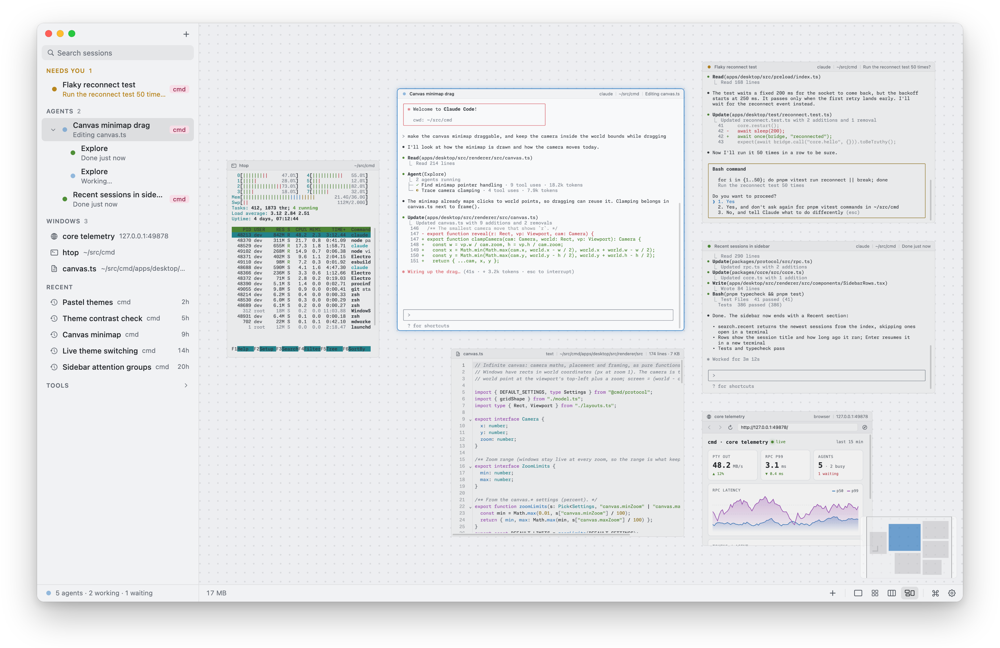
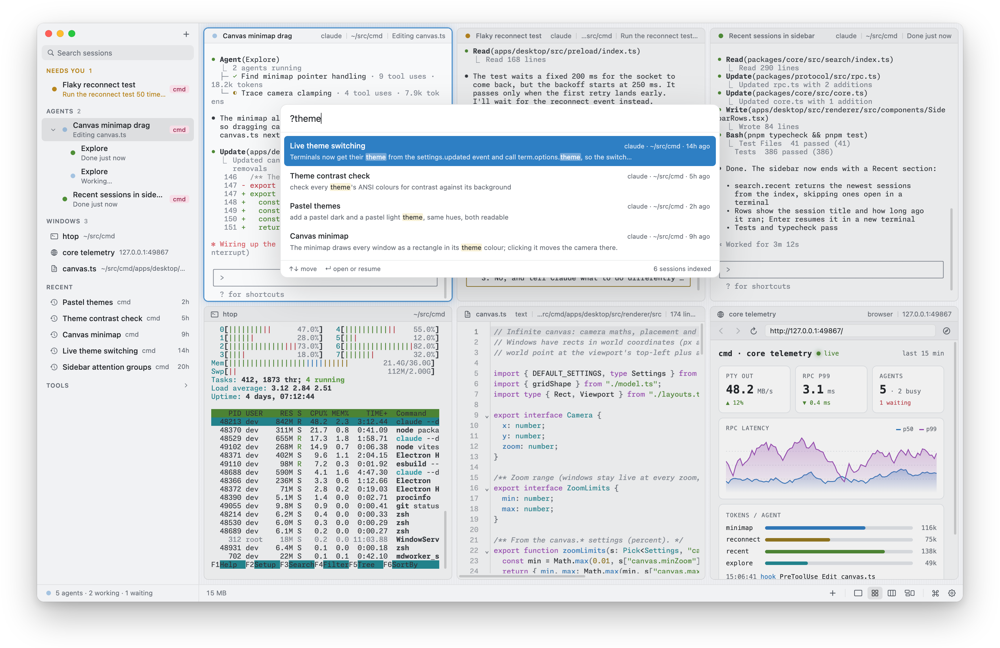

<p align="center">
  
</p>

<h1 align="center">cmd</h1>

<p align="center">
  A terminal for working with coding agents, on macOS.
</p>

<p align="center">
  <a href="https://github.com/janoelze/cmd/releases/latest">Download</a> ·
  <a href="#features">Features</a> ·
  <a href="#magic-windows">Magic windows</a> ·
  <a href="#keyboard-shortcuts">Shortcuts</a> ·
  <a href="#cli">CLI</a> ·
  <a href="DEVELOPMENT.md">Development</a>
</p>

<picture>
  <source media="(prefers-color-scheme: dark)" srcset="docs/screenshots/hero-dark.png">
  
</picture>

Run Claude Code, Codex and your shells side by side, and see at a glance which agent is waiting for you. Lay out terminals, editors and browser windows in a grid, a scrolling strip inspired by PaperWM, or on an infinite canvas. Terminals live in a background process, so quitting or reloading the app never kills them.

## Features

- **Knows your agents.** Claude Code, Codex, Gemini, Aider and others are detected on their own, even behind wrappers and sandboxes. The sidebar puts agents waiting for input first, then the ones working, then the ones done; subagents show as children.
- **Terminals that outlive the app.** A long-lived core process owns every terminal. Close the window or restart the app: your sessions are still there.
- **Four layouts.** Focus on one window, tile them in a grid, scroll through a horizontal strip of windows inspired by [PaperWM](https://github.com/paperwm/PaperWM), or arrange them freely on a zoomable canvas with a minimap.
- **Every past session, searchable.** Typo-tolerant full-text search over your Claude Code, Codex, Qwen Code and Copilot CLI transcripts (including profiles and custom config dirs), from the palette or the sidebar. Return resumes a session in a new terminal.
- **More than terminals.** Browser, file tree, text editor and Markdown windows sit next to your terminals. `open README.md` in the shell opens it in cmd. Right-click a browser window for Device Size to see a page at a phone, tablet or desktop size.
- **Magic windows.** Describe what you want to see ("show my VPN status", a JSON URL, "my open pull requests") and an agent builds a live widget for it, in your theme, that keeps itself up to date. [More below](#magic-windows).
- **Notifications that lead somewhere.** An agent waiting, a bell, a long command finishing, an OSC 9/777/99 notification or `cmd notify`: the terminal is marked until you look at it, and counts toward the Dock badge.
- **A complete terminal.** Find in scrollback, jump between prompts, copy a command's output, inline images (Sixel, iTerm2's protocol), programs copying over ssh (OSC 52), drag files in for their paths, a check before risky pastes, Option as Meta on either side, modern Unicode widths.
- **Keyboard first.** Every action is in the menu bar and the command palette (⌘K), and every shortcut can be remapped.
- **Scriptable.** The `cmd` CLI spawns, messages, waits on and stops agents, so an agent can run other agents.
- **16 themes**, light and dark, following the system or not.

<picture>
  <source media="(prefers-color-scheme: dark)" srcset="docs/screenshots/canvas-dark.png">
  
</picture>

<picture>
  <source media="(prefers-color-scheme: dark)" srcset="docs/screenshots/search-dark.png">
  
</picture>

## Magic windows

<picture>
  <source media="(prefers-color-scheme: dark)" srcset="docs/screenshots/magic-dark.png">
  
</picture>

Press ⇧⌘M and type what the window should show: a question, a URL, some JSON, a command. cmd turns it into a small live window:

- **It looks around first when it needs to.** For "show my VPN connection status", the agent checks your network interfaces, routes and VPN clients with read-only commands before deciding what to show. You watch its steps in the window while it works.
- **It's a small app that has to work.** The agent writes the widget as a few files: `data.ts` fetches the data (TypeScript, run by Deno with only the permissions it declares), checked against a schema; the view is type-checked against that data. Before it shows anything, it runs the data, renders the widget in both themes and looks at the result; cmd then checks it all again.
- **It stays live.** cmd re-runs the widget's data on its own schedule, so refreshing never calls the model. The title bar says how fresh the data is, or why it is stale ("HTTP 403 (rate limited?)"), and waits as long as a server asks. Fix hands the error to the agent.
- **It matches cmd.** Widgets use your theme's colours, your terminal font and a small built-in kit, so they look right next to your terminals in every theme, light or dark.
- **Change it by asking.** Right-click a widget and choose Change… (or press ⌘L), then type in its title bar: "bigger numbers", "make it a line chart", "only failed runs".
- **Edit it.** ⌘E turns the window around: every version with a screenshot (restore any of them), the widget's settings (a city, a repository, a token), its files (edit them anywhere, Claude Code included), and its health.
- **Or it's a command.** When a terminal program already does the job (`btop`, `log stream`), you get the command, typed into a new terminal for you to run.

**Setup.** Magic windows use your own API key, from Anthropic or OpenAI. Under Settings → Magic Windows, pick the provider, paste its key and choose a model: the list shows the models your key can use. Keys are stored by cmd outside `settings.json`, readable only by you, and nothing is read from your environment. From a terminal: `pbpaste | cmd settings secret magic.anthropic.apiKey`.

**Setup, part two.** Widgets' data runs on [Deno](https://deno.com). cmd uses the one on your PATH or Homebrew's, or downloads its own the first time a widget needs it.

**Safety.** The agent can only read. Every command it runs must pass a read-only policy, and its widgets' data.ts runs with only the hosts and programs its manifest lists, all inside a sandbox that blocks writes. Your keys, keychains, browser profiles and `.env` files stay off limits to it. Logged-in tools like `gh` and `glab` may use your login to fetch data, but tokens never reach the model. Widgets run in a sandboxed frame without network access.

## Install

Requires macOS on Apple Silicon. Install or update to the latest release with:

```sh
curl -fsSL https://raw.githubusercontent.com/janoelze/cmd/master/scripts/install.sh | sh
```

Or download the `.dmg` from the [latest release](https://github.com/janoelze/cmd/releases/latest) and move cmd to Applications. Releases are signed and notarized by Apple. Versions before 0.2.5 weren't, and can't update themselves, so install once more with either way above.

cmd updates itself: new versions download in the background and install when you quit it, and your terminals keep running. Settings → Updates switches to notify-only or off; Check for Updates… in the cmd menu checks now.

**Agent state.** cmd sees that an agent is running from its process alone. To also see what it is doing (working, waiting for input, done, which tool it runs), add cmd's hook to the agent: `cmd hooks claude` (or `codex`) prints the snippet to merge into `~/.claude/settings.json` (or `~/.codex/hooks.json`). Hooks of the ghostty-agents fork work unchanged.

## Getting started

Settings → Keyboard Shortcuts lists all shortcuts.

| | |
|---|---|
| ⌘N | new terminal |
| ⌥⌘N | new Claude session |
| ⇧⌘M | new Magic window |
| ⌘K | command palette: type to find anything, `>` commands, `@` sessions, `?` past sessions |
| ⌥⌘1 / 2 / 3 / 4 | focus / grid / strip / canvas |
| ⌘↩ | focus on the selected window, and back |
| ⌃⌘J | jump to the next session that needs you |
| ⌘, | settings |

## Keyboard shortcuts

Every shortcut is a real menu-bar item. Remap any of them under Settings → Keyboard Shortcuts (click a shortcut and press the new keys, or + to add another), or in `~/.config/cmd/keybindings.json` (map a command id to a shortcut, a list, or `null`). Both stay in sync; the Settings page saves to that file.

| | |
|---|---|
| ⌘N (⌘T) | new terminal, in the folder of the selected window (terminal, file browser, file) |
| ⌥⌘N | new Claude session |
| ⇧⌘M | new Magic window; in one, ⌘L changes it, ⌘E edits it (versions, settings, files, health), ⌘R refreshes its data, ⌘. stops it while it is being made |
| ⌘W | close the frontmost thing: the palette, then the terminal (asks if something is running), then the window |
| ⇧⌘W | close window (terminals keep running) |
| ⌥⌘← / ⌥⌘→ (⇧⌘[ / ⇧⌘]) | previous / next session |
| ⌘1–9 | select session |
| ⌃⌘J | next session needing attention |
| ⌘K | command palette (`>` commands, `@` sessions) |
| ⌘, | settings |
| ⌘C / ⌘V / ⌘A | copy / paste / select all, in the terminal or a text field |
| ⌥⌘K | clear buffer |
| ⌘F / ⌘G / ⇧⌘G | find in the terminal's scrollback (or the text window), next, previous |
| ⌘↑ / ⌘↓ | terminal: jump to the previous / next prompt (needs shell integration) |
| ⇧⌘A | copy the last command's output |
| ⌘Home / ⌘End, ⌘PgUp / ⌘PgDn | terminal: scroll to the top / bottom, by a page |
| ⌥-drag | select text in programs that use the mouse (Claude Code, vim) |
| click | at a shell prompt, move the cursor to where you clicked |
| ⌘+ / ⌘− / ⌘0 | terminal text size (this session only) |
| ⌥⌘1/2/3/4 | focus / grid / strip / canvas |
| ⌘↩ | toggle focus: the selected window fills the pane; again returns to grid, strip or canvas |
| ⇧⌘1 / ⇧⌘2 | canvas: zoom to fit all / to the selected window |
| ⌃⌘S | show/hide sidebar |
| ⇧⌘F | search the sidebar: open windows and past sessions |
| ⌥⌘R | show folder in Finder |

**Canvas.** Drag a title bar to move a window, and an edge or corner to resize it. Pinch or ⌘-scroll to zoom; scroll or drag the background to pan. Double-click a title bar to zoom to that window, or the background to fit everything. Click or drag the minimap to move around.

**Sidebar.** Open windows are grouped into Needs you, Agents and Windows, followed by your recent past sessions. Type in its search field to filter windows and search past sessions; Return opens the result. Right-click a row or a terminal for more: copy the resume command, reveal the transcript, new terminal here.

## CLI

```sh
cmd ls                               # terminals and agents as a tree
cmd new -- htop                      # open a terminal running a command
cmd spawn claude "fix the tests"     # start an agent; inside an agent it becomes a child
cmd send <agent> "also update docs"
cmd read <agent> --lines 40
cmd wait <agent…> --any --timeout 50
cmd kill <agent> --tree
cmd notify "deploy finished"         # a notification; inside cmd it marks this terminal
cmd events                           # NDJSON event stream
cmd settings                         # list; `set KEY VALUE`, `reset KEY`, `path`
cmd hooks claude                     # print the hook config for ~/.claude/settings.json
cmd magic "how full is my disk"      # build a Magic widget without the app: shows its steps, prints its folder
cmd magic eval                       # build the Magic eval cases and judge them (for tuning its prompt)
cmd widget check [dir]               # a widget folder: types, a data run, renders (new | check | run | preview)
```

The CLI is not bundled with the app yet. Run it from a checkout (see [DEVELOPMENT.md](DEVELOPMENT.md)) and link it onto your PATH: `ln -s $PWD/packages/cli/bin/cmd ~/bin/cmd`.

## Configuration

Settings live in `~/.config/cmd/settings.json` (comments allowed). Change them in the Settings window (⌘,), with `cmd settings set`, or in the file; changes apply immediately. The few that only affect new terminals (`shell.program`, `shell.login`, `shell.integration`) are marked as such.

Notifications (which sources show a system notification, sound, Dock bounce) are under `notifications.*`; right-click a terminal to mute it.

## How it works

cmd is an Electron app in front of a separate core process that owns the terminals, the agent tree, settings and the transcript index. The app, the `cmd` CLI and agent hooks all talk to the core over a Unix socket. Design notes are in [`docs/`](docs/00-overview.md); building and contributing are in [DEVELOPMENT.md](DEVELOPMENT.md).
